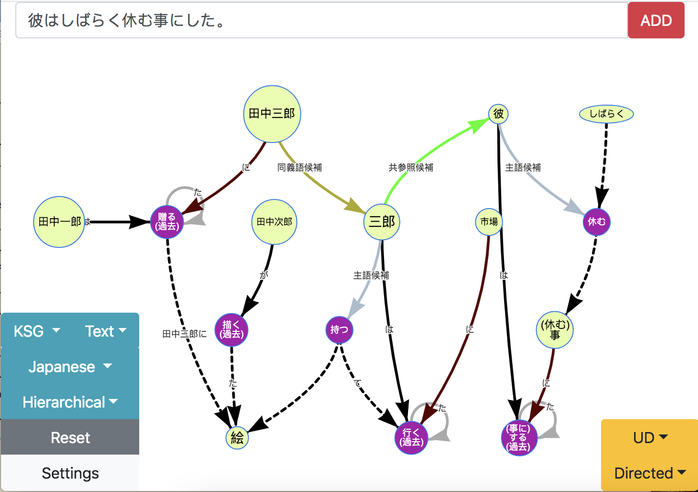
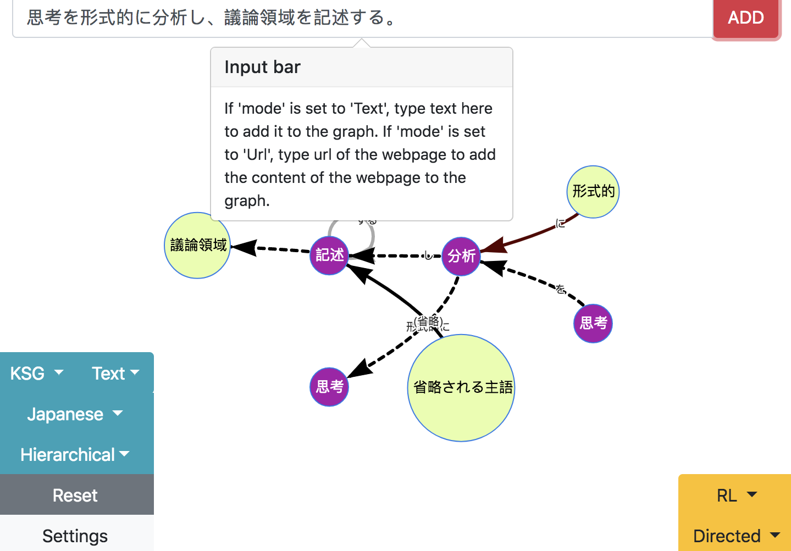
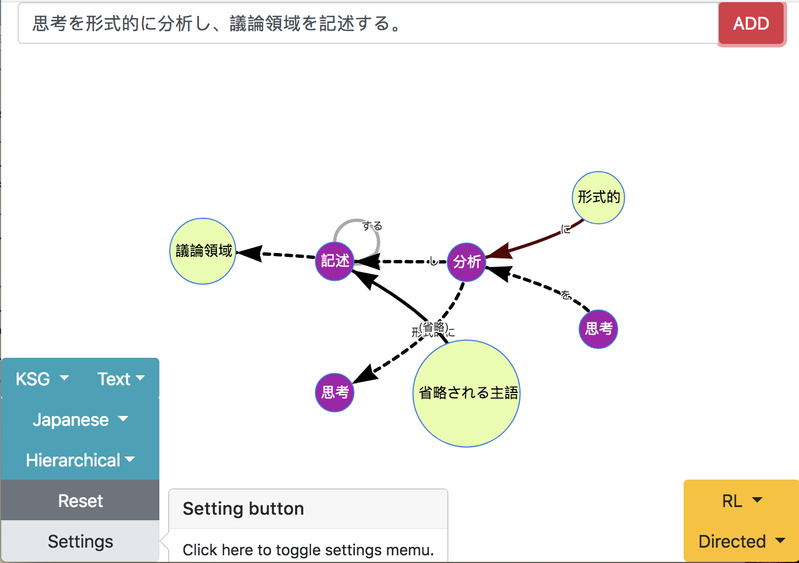
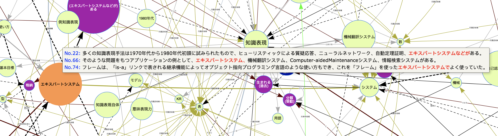
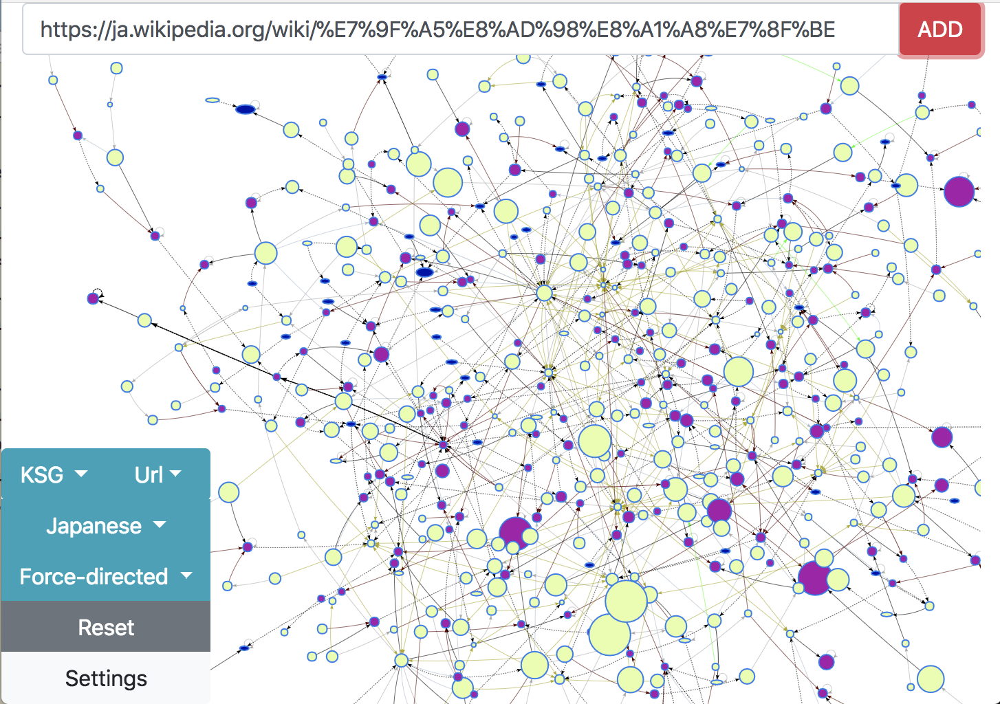

# naruhodo-viewer

[](https://opensource.org/licenses/MIT)

[English version](README.md)

`naruhodo-viewer`は[naruhodo](https://github.com/superkerokero/naruhodo)で生成されたグラフをインターラクティブに表示するウェブアプリです。



## インストール

まずは[naruhodo](https://github.com/superkerokero/naruhodo)をインストールする必要があります。 `naruhodo`のインストールに関する情報は [ここ](https://github.com/superkerokero/naruhodo/blob/master/README-ja.md#インストール)に載せています。

それからはこのリポジトリをローカルに`git clone`してください:

```bash
git clone https://github.com/superkerokero/naruhodo-viewer.git
```

`git clone`したリポジトリのルートフォルダに移動して、`config.json` ファィルを編集します:

```json
{
    "mp": false,
    "wv": "",
    "debug": false
}
```

`mp` を `true` にする事で、 `naruhodo` のマルチプロセシング機能を利用します（マルチコアのCPUでスピードアップする可能性があります）。デフォルトは`false`です。 

`naruhodo` に実装された試験的な共参照解析機能を利用するには、`wv` を word2vec のモデルにパスに変える必要があります。word2vec のモデルがなければ、"" のままで結構です。

`debug` を `true`　にするとdebug機能を利用します。

次にルートフォルダに移動してターミナルを開き、このコマンドでウェブサーバーを起動します:

```bash
python viewer.py
```

これでブラウザでこのアドレスから `naruhodo-viewer` にアクセスします。

```
http://localhost:8000
```

## 基本的な利用方法

一番上の入力欄でモードに応じてテキストやURLを入力し、`ADD` をクリックすればグラフに内容を追加できます。



`Setting` ボタンで設定メニューを表示させます。



ノードにマウスポインターを移動すれば（モバイルデバイスならノードにタップ）、ノードの情報が含まれるオリジナルのテキストが見れます。



`naruhodo`のスクレーパー機能を利用して、直接ウェブぺージの内容をグラフに追加できます。ただグラフのノード数が大きすぎると性能が著しく落ちますので、注意が必要です。

