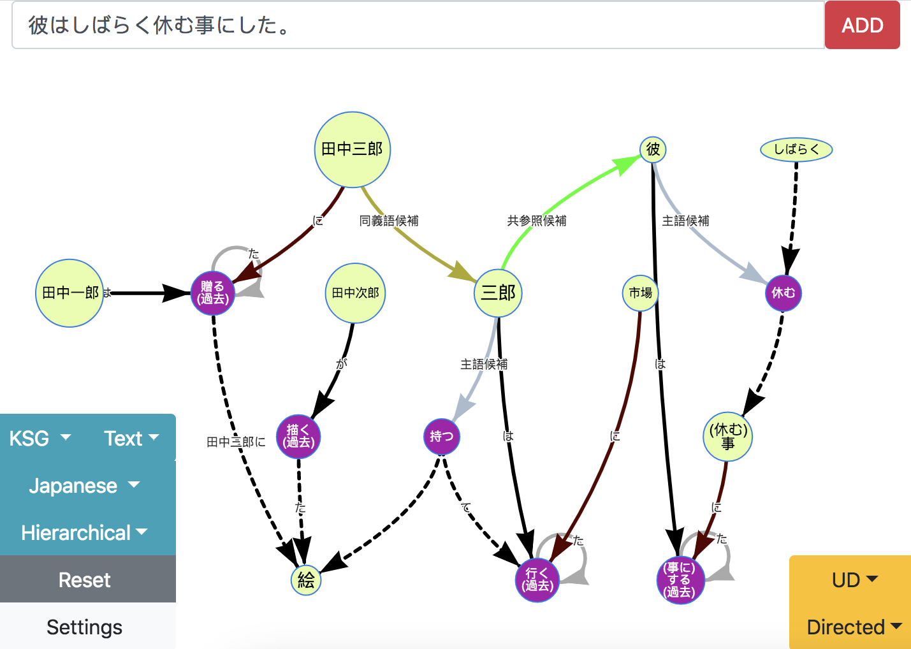
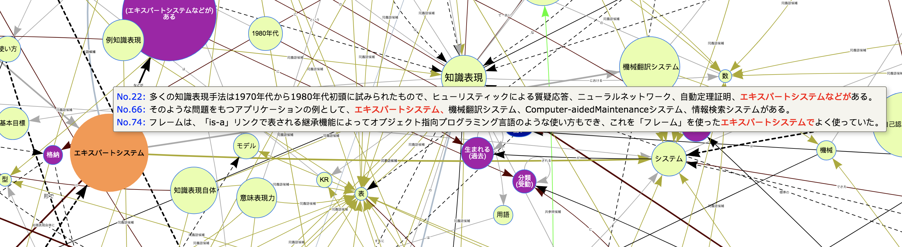

# naruhodo-viewer

[](https://opensource.org/licenses/MIT)

[日本語はこちら](README-ja.md)

A web application for interactive visualization of semantic graphs generated from [naruhodo](https://github.com/superkerokero/naruhodo).



## Installation

First you need to install **the latest version** of [naruhodo](https://github.com/superkerokero/naruhodo) and make sure it is working properly. For installation and setup of `naruhodo`, refer to this [link](https://github.com/superkerokero/naruhodo/blob/master/README.md#Installation).

Then you need to clone this repository to your local disk:

```bash
git clone https://github.com/superkerokero/naruhodo-viewer.git
```

Go to the directory of the app you have cloned, and edit `config.json` file in the root folder:

```json
{
    "mp": false,
    "wv": ""
}
```

If `mp` is set to `true`, `naruhodo` will be run in multiprocessing mode(may provide speedup for multi-processor cpus), the default value is `false`. 

If you want to use experimental coreference resolution function in `naruhodo` based on word embeddings, you need to change `wv` to the string of your word2vec model path. Otherwise leave it as an empty string.

A complete list of available config parameters and corresponding default values can be found in [config-parameters](https://github.com/superkerokero/naruhodo-viewer/blob/master/README.md#Config-parameters) section.

Next, open a terminal from the root folder of the repository, and use the following command to start the web server:

```bash
python viewer.py config.json
```

Now you can open your browser and go to the following address to use the app.

```
http://localhost:8000
```

## Basic-Usage

* You can use the input bar to add contents to the graph.


* Use `Setting` button to toggle setting menu.


* When you move your cursor over a node in the graph(or touch a node on mobile   devices), a popup window will show you the original text that contains this node and its relative position in the input context.



* You can also add contents of webpages into graph directly using `naruhodo`'s built-in scraper. But please be careful with large amount of texts, since too many nodes and edges in the graph will degrade the webapp's performance significantly.


* You can use clustering functions in the `setting` menu to cluster certain nodes together. A cluster node is repsented in a `database` shape like in the following snapshot. You can open a cluster by clicking the cluster node. Currently 3 types of clustering are supported:
  * Cluster by synonyms
  * Cluster by coreferences
  * Cluster by meaning(for meaningless stop words)
* You can also use `ClusterAll` and `OpenAll` buttons to cluster or open all available clustering types at once.


## Config-parameters

| name        | default            | description                                 |
|-------------|--------------------|---------------------------------------------|
| mp          | false              | Use multiprocessing in naruhodo or not.     |
| wv          | ""                 | Path to your word2vec model.                |
| debug       | false              | Debug mode                                  |
| server_ip   | "http://localhost" | IP address of your naruhodo-viewer server.  |
| server_port | 8000               | Port number of your naruhodo-viewer server. |