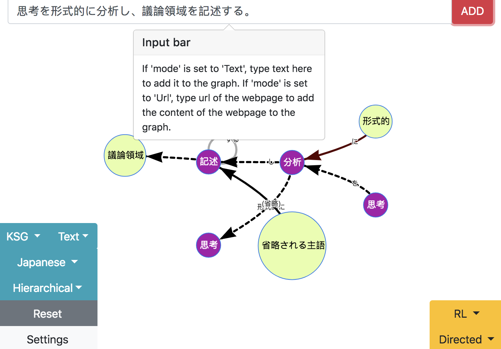
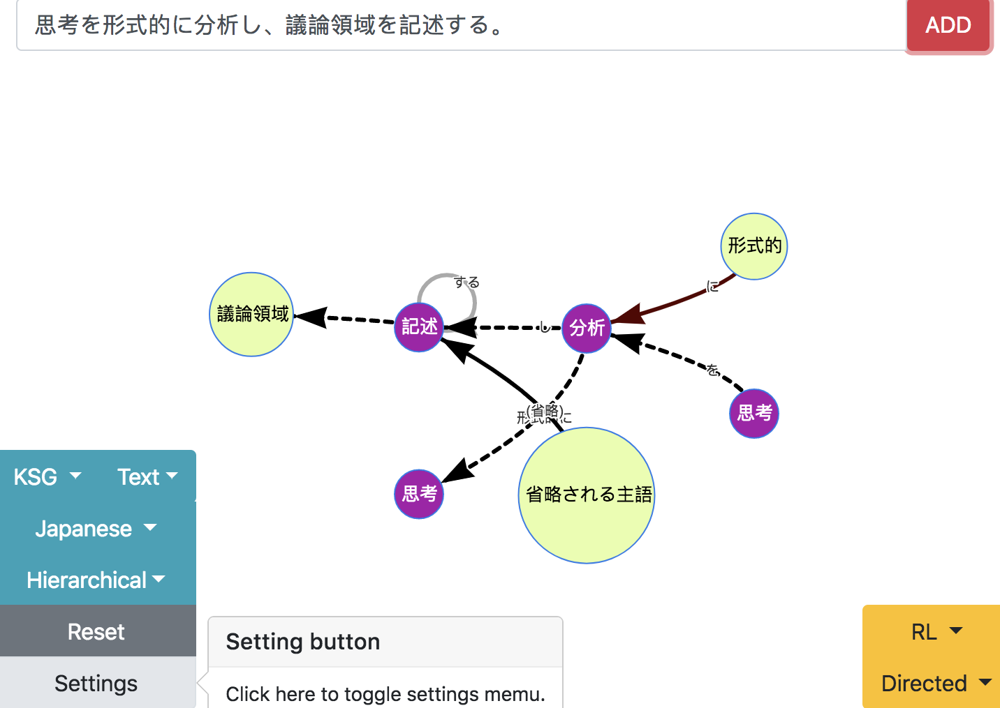

# naruhodo-viewer

[](https://opensource.org/licenses/MIT)

A web application for interactive visualization of semantic graphs generated from [naruhodo](https://github.com/superkerokero/naruhodo).


## Installation

First you need to install [naruhodo](https://github.com/superkerokero/naruhodo) and make sure it is working properly. For installation and setup of `naruhodo`, refer to this [link](https://github.com/superkerokero/naruhodo/blob/master/README.md#Installation).

Then you need to clone this repository to your local disk:

```bash
git clone https://github.com/superkerokero/naruhodo-viewer.git
```

Go to the directory of the app you have cloned, and edit `config.json` file in the root folder:

```json
{
    "mp": false,
    "wv": "",
    "debug": false
}
```

If `mp` is set to `true`, `naruhodo` will be run in multiprocessing mode(may provide speedup for multi-processor cpus), the default value is `false`. 

If you want to use experimental coreference resolution function in `naruhodo` based on word embeddings, you need to change `wv` to the string of your word2vec model path. Otherwise leave it as an empty string.

If you need debugging, change `debug` to `true`.

Next, open a terminal from the root folder of the repository, and use the following command to start the web server:

```bash
python viewer.py
```

Now you can open your browser and enter the following address to use the app.

```
http://localhost:8000
```

## Basic-Usage

You can use the input bar to enter text to want to add to graph and click `ADD` button to apply the change..



Use `Setting` button to toggle setting menu.



When you move your cursor over a node in the graph(or touch a node on mobile devices), the following popup will show you the original text that contains this node.


Tou can also add contents of webpages into graph directly using `naruhodo`'s built-in scaraper. But be careful with large amount of texts, too many nodes and edges in the graph will degrade the webapp's performance greatly.

